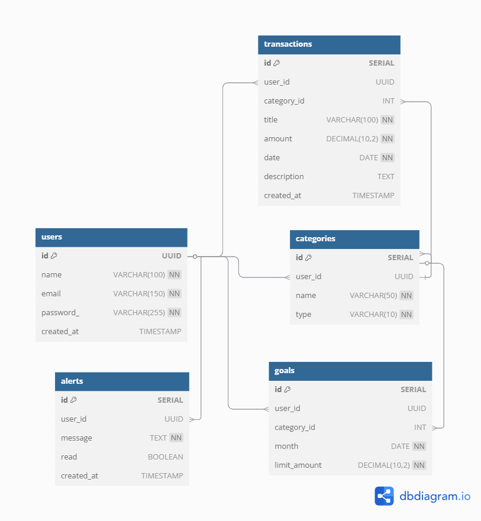
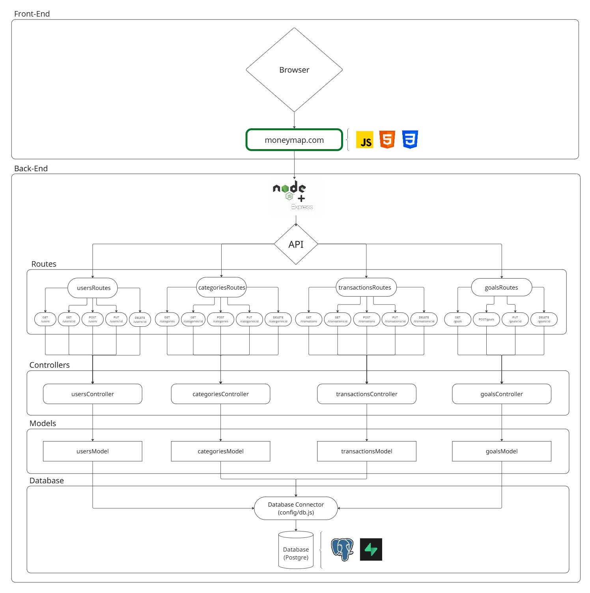

# Web Application Document - Projeto Individual - Módulo 2 - Inteli

<h1 align="center">

 MoneyMap 

</h1>

### Rayssa Guedes França

## Sumário

1. [Introdução](#c1)  
2. [Visão Geral da Aplicação Web](#c2)  
3. [Projeto Técnico da Aplicação Web](#c3)  
4. [Desenvolvimento da Aplicação Web](#c4)  
5. [Referências](#c5)  

 

## 1. Introdução

**MoneyMap** é uma aplicação de controle financeiro pessoal que permite aos usuários registrar suas receitas e despesas, definir metas de gastos, visualizar seu saldo atual, acompanhar seu desempenho financeiro e receber alertas sobre possíveis excessos. O sistema também oferece funcionalidades bônus, como análise inteligente de gastos e projeção de economia.

## 2. Visão Geral da Aplicação Web

### 2.1. Personas (Semana 01 - opcional)

*Posicione aqui sua(s) Persona(s) em forma de texto markdown com imagens, ou como imagem de template preenchido. Atualize esta seção ao longo do módulo se necessário.*

### 2.2. User Stories (Semana 01 - opcional)

*Posicione aqui a lista de User Stories levantadas para o projeto. Siga o template de User Stories e utilize a referência USXX para numeração (US01, US02, US03, ...). Indique todas as User Stories mapeadas, mesmo aquelas que não forem implementadas ao longo do projeto. Não se esqueça de explicar o INVEST de 1 User Storie prioritária.*

---

## 3. Projeto da Aplicação Web

&emsp;A seguir, são apresentados os principais aspectos técnicos e estruturais do desenvolvimento da aplicação web MoneyMap. Esta seção contempla desde a modelagem do banco de dados até a arquitetura da solução, incluindo diagramas, implementação dos modelos (Models), estrutura de controle (MVC), além de elementos visuais como wireframes, guia de estilos e protótipos. Também são detalhadas a estrutura da WebAPI e a interface do sistema, demonstrando a integração entre frontend e backend, com foco na organização, usabilidade e consistência da aplicação.

### 3.1. Modelagem do banco de dados 

<src> 
  
  
Figura 1: Diagrama do banco de dados

</src>

Arquivo de modelagem física do banco de dados: [runSQLScript](../scripts/init.sql)

Este arquivo contém a **modelagem física** do banco de dados para um sistema de controle financeiro pessoal. Ele foi desenvolvido para organizar e registrar as movimentações financeiras de usuários, incluindo **receitas**, **despesas**, **categorias personalizadas**, **metas mensais** e **alertas automatizados**.

O banco de dados utiliza **PostgreSQL** como sistema gerenciador, com a extensão `uuid-ossp` para geração automática de identificadores únicos (**UUID**) para os usuários. A estrutura é composta por tabelas interligadas por meio de chaves estrangeiras, com **integridade referencial garantida**.

Tabelas principais:

### 
`users` Armazena informações dos usuários:
- `id`: UUID, chave primária
- `name`: nome do usuário
- `email`: e-mail único
- `password_`: senha
- `created_at`: data de criação

###
`categories` Define categorias financeiras personalizadas:
- `id`: SERIAL, chave primária
- `user_id`: UUID, chave estrangeira para `users`
- `name`: nome da categoria
- `type`: tipo ("receita" ou "despesa")

### 
`transactions` Registra as transações financeiras:
- `id`: SERIAL, chave primária
- `user_id`: UUID, chave estrangeira para `users`
- `category_id`: chave estrangeira para `categories` (opcional)
- `title`, `amount`, `date`, `description`, `created_at`

### 
`goals` Define metas mensais por categoria:
- `id`: SERIAL, chave primária
- `user_id`: UUID
- `category_id`: INT
- `month`: data de referência
- `limit_amount`: valor limite
- Restrição de unicidade: (`user_id`, `category_id`, `month`)

### 
`alerts` Armazena alertas e notificações:
- `id`: SERIAL, chave primária
- `user_id`: UUID
- `message`: texto do alerta
- `read`: booleano (lido/não lido)
- `created_at`: data de criação

Relacionamentos e Regras de Integridade:

- Um **usuário** pode ter várias **categorias**, **transações**, **metas** e **alertas**.
- As **categorias** pertencem a um único usuário.
- As **transações** pertencem a um usuário e podem ou não estar vinculadas a uma categoria.
- As **metas** são específicas por usuário, categoria e mês.
- Os **alertas** são individuais por usuário.
- Regras como `ON DELETE CASCADE` e `ON DELETE SET NULL` foram aplicadas para preservar a consistência e o histórico.

---

### 3.1.1 BD e Models (Semana 5)
*Descreva aqui os Models implementados no sistema web*

### 3.2. Arquitetura (Semana 5)

	

Figura 2: Diagrama de Arquitetura da aplicação

 O diagrama acima ilustra a arquitetura da aplicação, que segue o padrão MVC (Model-View-Controller) e está dividida em duas camadas principais: **Front-end** e **Back-end**. 

#### **Front-end**

- **HTML, CSS e JS**: São as tecnologias base para a construção da interface do usuário.

#### **Back-end**

- **Node.js**: Ambiente de execução para JavaScript no lado do servidor.
- **Express.js**: Framework para criar a API RESTful que gerencia as requisições e respostas.
- **PostgreSQL**: Banco de dados relacional utilizado para armazenar as informações da aplicação.
- **Supabase**: Ferramenta que complementa o PostgreSQL, oferecendo funcionalidades adicionais como autenticação e armazenamento.

#### **Fluxo de Dados**

1. O usuário interage com a interface no navegador (HTML, CSS, JS).
2. As ações do usuário são processadas pelo React, que utiliza o Axios para enviar requisições HTTP para a API.
3. A API, construída com Express.js, recebe as requisições e as encaminha para os controllers.
4. Os controllers processam as requisições, interagindo com os models definidos no Sequelize.
5. O Sequelize traduz as operações para comandos SQL, que são executados no banco de dados PostgreSQL.
6. Os dados retornam pelo mesmo caminho, sendo enviados do banco para os models, dos models para os controllers, e dos controllers para o front-end, onde são exibidos ao usuário.

Essa arquitetura modular promove a separação de responsabilidades, facilitando a manutenção, escalabilidade e testes da aplicação.

### 3.3. Wireframes (Semana 03 - opcional)

*Posicione aqui as imagens do wireframe construído para sua solução e, opcionalmente, o link para acesso (mantenha o link sempre público para visualização).*

### 3.4. Guia de estilos (Semana 05 - opcional)

*Descreva aqui orientações gerais para o leitor sobre como utilizar os componentes do guia de estilos de sua solução.*

### 3.5. Protótipo de alta fidelidade (Semana 05 - opcional)

*Posicione aqui algumas imagens demonstrativas de seu protótipo de alta fidelidade e o link para acesso ao protótipo completo (mantenha o link sempre público para visualização).*

### 3.6. WebAPI e endpoints (Semana 05)

*Utilize um link para outra página de documentação contendo a descrição completa de cada endpoint. Ou descreva aqui cada endpoint criado para seu sistema.*  

### 3.7 Interface e Navegação (Semana 07)

*Descreva e ilustre aqui o desenvolvimento do frontend do sistema web, explicando brevemente o que foi entregue em termos de código e sistema. Utilize prints de tela para ilustrar.*

---

## 4. Desenvolvimento da Aplicação Web (Semana 8)

### 4.1 Demonstração do Sistema Web (Semana 8)

*VIDEO: Insira o link do vídeo demonstrativo nesta seção*
*Descreva e ilustre aqui o desenvolvimento do sistema web completo, explicando brevemente o que foi entregue em termos de código e sistema. Utilize prints de tela para ilustrar.*

### 4.2 Conclusões e Trabalhos Futuros (Semana 8)

*Indique pontos fortes e pontos a melhorar de maneira geral.*
*Relacione também quaisquer outras ideias que você tenha para melhorias futuras.*

## 5. Referências

_Incluir as principais referências de seu projeto, para que o leitor possa consultar caso ele se interessar em aprofundar._ 

---
---